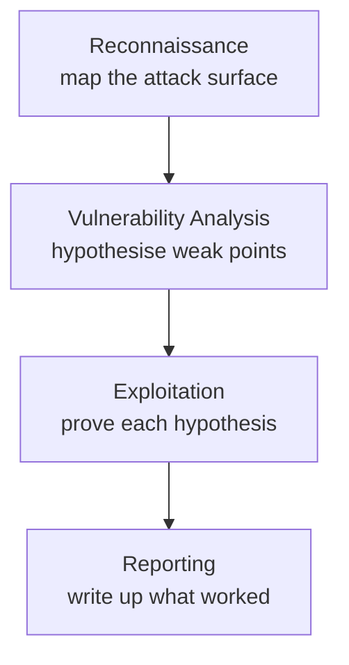
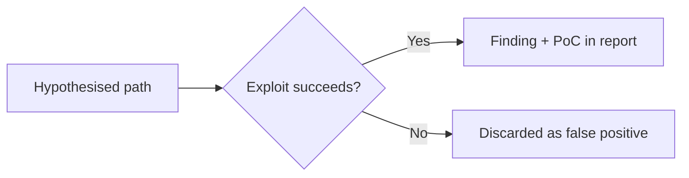

# Architecture
{: .no_toc }

Dapper emulates a human penetration tester's methodology using a multi-agent
architecture. It combines white-box source-code analysis with black-box
dynamic exploitation, organised into four phases that progressively narrow a
broad attack surface down to a short list of *proven* vulnerabilities.

1. TOC
{:toc}

---

## The four-phase methodology

A human pentester doesn't start by firing exploits. They first understand the
target, form hypotheses about where it's weak, try to break it, and only then
write up what actually worked. Dapper follows the same arc:

Each phase consumes the deliverables of the phase before it, so context flows
forward and stays focused. The reconnaissance map tells the vulnerability
agents where to look; the vulnerability agents' hypotheses tell the exploit
agents what to try; the exploit agents' evidence is the only thing the report
is allowed to contain.

{: .note }
> Internally the pipeline has more than four steps — pre-reconnaissance and
> threat modeling feed into reconnaissance, and reporting is a multi-stage
> assembly. The four phases above are the conceptual methodology; the
> [agent pipeline]({{ '/concepts/agent-pipeline' | relative_url }}) page covers
> the exact execution order.

## White-box plus black-box

Most scanners pick one lens. Static analysers read code and drown you in
*potential* issues with no proof. DAST tools poke a running app from the
outside and miss anything they can't reach by fumbling. Dapper deliberately
uses both, and lets each cover the other's blind spot:

| Lens | What it sees | What it misses |
|:-----|:-------------|:---------------|
| **White-box** (source analysis) | Data flows, sinks, auth checks, hidden endpoints, framework quirks | Whether a path is actually reachable and exploitable at runtime |
| **Black-box** (live exploitation) | Real runtime behaviour, real responses, real impact | Code paths it never discovers from the outside |

The vulnerability agents read the source to form *informed* hypotheses — not
blind fuzzing — and the exploit agents then validate those hypotheses against
the live application. A finding only survives if both lenses agree.

{: .warning }
> Dapper Lite is **white-box only**: it expects access to the target's source
> repository. See [Disclaimers]({{ '/resources/disclaimers' | relative_url }}).

### Phase 1 — Reconnaissance

The first phase builds a comprehensive map of the application's attack surface.
Dapper analyses the source and runs reconnaissance tools (Nmap, Subfinder,
WhatWeb) to understand the tech stack and infrastructure. It also explores the
live application through browser automation to correlate code-level insight
with real-world behaviour, producing a map of entry points, API endpoints, and
authentication mechanisms for the next phase. A threat-modeling step turns this
map into a prioritised view of where an attacker would push hardest.

### Phase 2 — Vulnerability analysis

A specialist agent for each vulnerability class hunts for flaws **in parallel**.
For classes like injection and SSRF, agents perform a structured data-flow
analysis, tracing user input from its source to a dangerous sink. The
deliverable is a queue of **hypothesised exploitable paths** — not confirmed
bugs — that pass to validation. See the full list on the
[agent pipeline]({{ '/concepts/agent-pipeline' | relative_url }}) page and
[Vulnerability coverage]({{ '/reference/vulnerability-coverage' | relative_url }}).

### Phase 3 — Exploitation

Dedicated exploit agents receive the hypothesised paths and attempt real-world
attacks using browser automation, command-line tools, and custom scripts. An
exploit agent only runs if its matching analysis agent actually queued
something to try.

### Phase 4 — Reporting

The final phase assembles validated findings into a professional, actionable
report. Only verified vulnerabilities are included, each with a **reproducible,
copy-and-paste Proof-of-Concept**. The reporting phase enriches the specialist
agents' evidence into a canonical `findings.json` and renders it as HTML, PDF,
Markdown, and CSV. See [Sample reports]({{ '/resources/sample-reports' | relative_url }}).

## "No Exploit, No Report"

This is Dapper's defining principle and the reason its output differs from a
typical scanner's. A hypothesised vulnerability is **never** reported on the
strength of code analysis alone. It must be *demonstrated* against the live
target — an actual injected payload, an actual bypassed auth check, an actual
exfiltrated response. If the exploit agent cannot reproduce impact, the
hypothesis is discarded as a false positive and never reaches the report.

The practical payoff: every line in a Dapper report is something you can
reproduce yourself by following the PoC.

## Orchestration and durability

The four phases run as a single durable [Temporal](https://temporal.io)
workflow, which gives the run crash recovery, queryable progress, and
intelligent retry. That machinery — and the way specialist agents are paired
and run concurrently — is detailed on
[The agent pipeline]({{ '/concepts/agent-pipeline' | relative_url }}).

## Audit & metrics

Dapper writes a crash-safe audit trail for every run under
`audit-logs/{hostname}_{sessionId}/`:

- `session.json` — metrics with attempt-level detail (cost, turns, timing).
- `prompts/` — the exact prompts each agent used (for reproducibility).
- `agents/` — turn-by-turn execution logs.
- `deliverables/` — security reports and findings.

Append-only logging with immediate flush survives `kill -9`; atomic writes keep
`session.json` from ending up half-written. See
[Monitoring runs]({{ '/guides/monitoring-runs' | relative_url }}).
