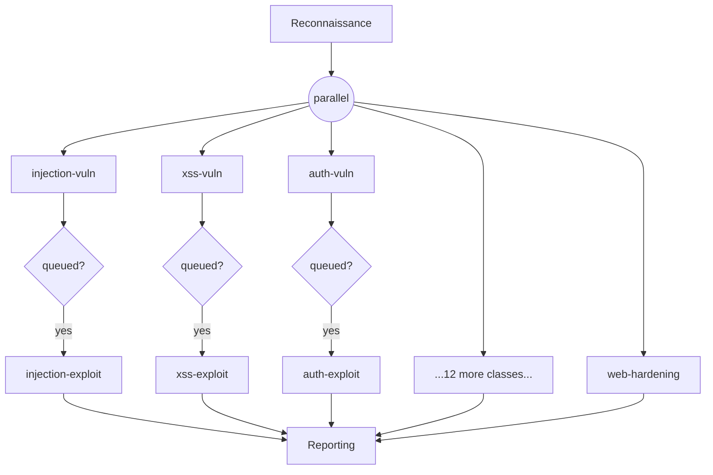

# The agent pipeline
{: .no_toc }

Dapper isn't a single script — it's a team of specialist agents orchestrated on
a durable workflow engine. This page explains how the agents are organised, how
they run concurrently as pipelined pairs, and how a long, expensive run survives
a crash without starting over.

1. TOC
{:toc}

---

## Why many small agents

You could ask one agent to "find and exploit every vulnerability." It would do a
mediocre job: its context window fills with unrelated detail, and the prompt
can't go deep on any single attack class. Dapper instead splits the work so each
agent has one narrow job and a prompt tuned for it.

There are two reasons this matters:

- **Focus.** An injection agent only thinks about injection. Its context stays
  full of relevant sinks and payloads, not XSS trivia.
- **Isolation.** One class failing (or burning its retries) doesn't sink the
  rest of the run — pipelines are independent.

Each vulnerability class gets a dedicated **analysis** agent and a matching
**exploitation** agent. The two surrounding phases — reconnaissance and
reporting — run as sequential agents.

## The full agent roster

The vulnerability/exploit pairs run during the parallel phase. Every class has
both an analysis and an exploitation agent, **except web hardening**, which is
analysis-only (it reports missing defences rather than exploiting them).

| Vulnerability class | Analysis agent | Exploit agent |
|:--------------------|:---------------|:--------------|
| Injection | `injection-vuln` | `injection-exploit` |
| Cross-site scripting | `xss-vuln` | `xss-exploit` |
| Authentication | `auth-vuln` | `auth-exploit` |
| Authorization | `authz-vuln` | `authz-exploit` |
| SSRF | `ssrf-vuln` | `ssrf-exploit` |
| Web attacks | `web-attacks-vuln` | `web-attacks-exploit` |
| Session & auth | `session-auth-vuln` | `session-auth-exploit` |
| Business logic | `business-logic-vuln` | `business-logic-exploit` |
| Client-side | `client-side-vuln` | `client-side-exploit` |
| Info gathering | `info-gathering-vuln` | `info-gathering-exploit` |
| Config / deploy | `config-deploy-vuln` | `config-deploy-exploit` |
| Session management | `session-mgmt-vuln` | `session-mgmt-exploit` |
| Error handling | `error-handling-vuln` | `error-handling-exploit` |
| Cryptography | `crypto-vuln` | `crypto-exploit` |
| API testing | `api-testing-vuln` | `api-testing-exploit` |
| Web hardening | `web-hardening` | — (analysis only) |

The sequential agents are `pre-recon`, `threat-model`, and `recon` (the
reconnaissance phase) and `report` (the reporting phase). See
[Vulnerability coverage]({{ '/reference/vulnerability-coverage' | relative_url }})
for what each class covers.

## Pipelined pairs, run in parallel

The vulnerability and exploitation phases are **not** two sequential phases with
a barrier between them. Instead, each class is its own little pipeline:

```
vuln agent  →  queue check  →  conditional exploit agent
```

An exploit agent starts the moment *its own* analysis agent finishes — it does
not wait for the other classes' analysis to complete. The queue check between
them is the [No Exploit, No Report]({{ '/concepts/architecture' | relative_url }})
gate in action: if the analysis agent queued no candidate paths, the exploit
agent is skipped entirely.

All of these pipelines launch concurrently:



Because the pipelines are independent, a failure in one does not abort the
others. The workflow uses `Promise.allSettled`, so a crash in, say, the SSRF
pipeline is logged and the run continues; reporting proceeds with whatever
evidence the surviving pipelines produced.

Each agent's browser automation runs in an **isolated profile** so concurrent
agents don't trample each other's sessions — see
[MCP & tooling]({{ '/concepts/mcp-tooling' | relative_url }}).

## Durable orchestration (Temporal)

The whole pipeline runs as a single [Temporal](https://temporal.io) workflow.
Temporal records every step so the run can be reconstructed and resumed, which
matters for runs that take hours and cost real money.

| Property | What it means |
|:---------|:--------------|
| **Crash recovery** | If the worker process dies mid-run, Temporal replays the workflow from its recorded history — completed agents are not re-run, and the pipeline resumes where it left off rather than restarting from zero. |
| **Intelligent retry** | Each agent activity retries with exponential backoff. Transient problems (network blips, rate limits, billing/spending-cap recovery) are retried; a defined set of permanent errors is classified non-retryable and fails fast. |
| **Queryable state** | The workflow exposes live progress — current phase, current agent, completed agents, cost — via `./dapper query` and the Temporal Web UI, without interrupting the run. |

### Retry, concretely

Two retry layers stack on top of each other:

- **Inside an activity**, the executor makes up to **3 attempts** per agent. On
  a retryable failure it rolls the workspace back to a git checkpoint and tries
  again with a cleaner slate; a failed *output validation* (missing deliverable)
  is itself treated as retryable.
- **At the Temporal layer**, the activity is retried with exponential backoff
  (coefficient 2) — production uses a 5-minute initial interval growing to a
  30-minute cap (to ride out billing/rate-limit windows), up to 50 attempts.
  Pipeline-testing mode uses 10-second intervals (30-second cap, 5 attempts) for
  fast iteration.

Errors classified as non-retryable include authentication, permission, invalid
request, request-too-large, configuration, invalid-target, and
execution-limit errors — these surface immediately instead of wasting retries.

{: .tip }
> Watch all of this live in the Temporal Web UI at
> <http://localhost:8233>, or poll from the CLI — see
> [Monitoring runs]({{ '/guides/monitoring-runs' | relative_url }}).

## The reasoning engine

Each agent is powered by the [Claude Agent SDK](https://docs.anthropic.com/en/docs/claude-code/sdk)
running with high autonomy: a very high turn budget and full tool permissions,
with the working directory set to the target repository. Agents reach the live
application through their attached tools, covered in
[MCP & tooling]({{ '/concepts/mcp-tooling' | relative_url }}).

## Crash-safe auditing

Every agent writes append-only logs that survive a hard kill, plus per-agent
cost, turn, and timing metrics. The result is a fully reproducible record of the
run under `audit-logs/{hostname}_{sessionId}/` — including the exact prompts each
agent used and a git checkpoint per attempt.
