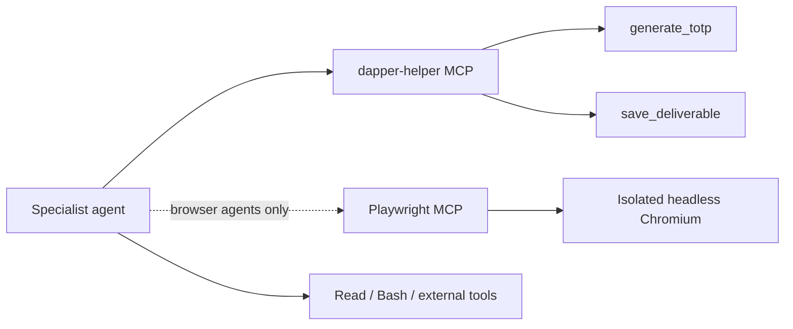

# MCP & tooling
{: .no_toc }

Agents reason with an LLM, but they *act* through tools. An agent that can only
read code can flag *potential* problems; an agent that can drive a browser,
generate a 2FA code, and run a scanner can *prove* them. Dapper gives every
agent a toolbox via the [Model Context Protocol (MCP)](https://modelcontextprotocol.io),
plus the standard file and shell tools that come with the Claude Agent SDK.

1. TOC
{:toc}

---

## What an agent is given

When Dapper launches an agent it configures the Claude Agent SDK with high
autonomy and attaches two MCP servers:

On top of the MCP tools, the SDK's built-in `Read`, `Bash`, and file tools let
agents read the source tree and invoke the external recon/DAST binaries
described below.

## The Claude Agent SDK configuration

Every agent runs through the same SDK call, tuned for autonomous, long-running
analysis:

| Option | Value | Why |
|:-------|:------|:----|
| `model` | `claude-sonnet-4-5-20250929` | The reasoning engine for each agent. |
| `maxTurns` | `10_000` | A very high ceiling so an agent can pursue a long attack chain without being cut off mid-investigation. |
| `permissionMode` | `bypassPermissions` | The agent acts without per-action prompts — it's operating on a target you've authorised, in a containerised run. |
| `cwd` | target repo path | The working directory is the target's source, so file tools and recon operate against the right tree. |
| `mcpServers` | `dapper-helper` (+ Playwright) | The tools below. |

{: .warning }
> `bypassPermissions` means agents run commands without asking. Only ever point
> Dapper at a target you own or are explicitly authorised to test — see
> [Disclaimers]({{ '/resources/disclaimers' | relative_url }}).

## dapper-helper MCP

A lightweight in-process MCP server attached to **every** agent. It's created
per run with the target directory captured in a closure, so parallel agents
write to the correct run's directory without racing. It exposes two tools:

### `generate_totp`

Produces a 6-digit time-based one-time password from a Base32 secret, so agents
can get past two-factor authentication during login. It implements TOTP/HOTP per
RFC 6238 / RFC 4226; the HMAC algorithm defaults to SHA-1 (what virtually all
authenticator apps and target systems expect) and can be set to SHA-256/512 when
a target supports it. See
[Authenticated testing]({{ '/guides/authenticated-testing' | relative_url }}).

### `save_deliverable`

The single, validated channel through which agents write their output —
analysis notes, exploitation evidence, and the structured candidate queues that
gate the exploit phase. Queue deliverables are validated against the expected
`{"vulnerabilities": [...]}` shape before they're written; an invalid queue is
rejected with a retryable error, so a malformed handoff can't silently break the
[pipeline]({{ '/concepts/agent-pipeline' | relative_url }}). Files land in the
run's `deliverables/` directory.

## Playwright MCP (per-agent browser)

Agents that need a browser get their **own** [Playwright](https://playwright.dev)
MCP instance, each with an isolated user-data directory (`playwright-agent1`
through `playwright-agent5`). Isolation matters because pipelines run
concurrently — without separate profiles, two agents would clobber each other's
cookies and sessions.

This is the **real Chromium** (headless; the system Chromium binary inside
Docker) that exploitation agents drive to navigate, fill forms, click, and
execute live browser-based attacks. Driving a real browser is how a finding gets
*proven* rather than merely flagged — it's the black-box half of Dapper's
[methodology]({{ '/concepts/architecture' | relative_url }}).

## External recon & DAST tools

Beyond MCP, agents shell out to established security tools during reconnaissance
and testing. These do the broad, mechanical discovery that an LLM shouldn't be
spending tokens on, and feed the attack-surface map that later phases attack.

| Tool | Role |
|:-----|:-----|
| [Nmap](https://nmap.org) | Network/port scanning — what's exposed and listening. |
| [Subfinder](https://github.com/projectdiscovery/subfinder) | Subdomain discovery — expands the surface beyond the obvious host. |
| [WhatWeb](https://github.com/urbanadventurer/WhatWeb) | Web technology fingerprinting — frameworks, servers, libraries. |
| [Schemathesis](https://schemathesis.readthedocs.io) | API testing driven by an OpenAPI/GraphQL schema. |

These run in the container image; missing tools can be skipped during
development with `PIPELINE_TESTING=true`. See
[Troubleshooting]({{ '/resources/troubleshooting' | relative_url }}).

## Why this combination matters

Code reading, a real browser, 2FA handling, validated deliverables, and recon
tooling together are what let an autonomous agent behave like a human pentester:
it can get past the login, navigate the app, carry an attack through to
demonstrated impact, and hand clean evidence to the next agent in the
[pipeline]({{ '/concepts/agent-pipeline' | relative_url }}).
