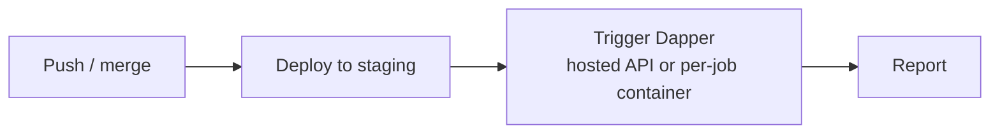

# CI/CD integration
{: .no_toc }

Dapper is most valuable when it runs on **every deployment**, not once a year. Wire it into your pipeline so each release to staging is automatically pentested.

1. TOC
{:toc}

---

## Two integration models

There are two ways to run Dapper from CI, and they suit different setups:

| Model | How it works | Best when |
|:------|:-------------|:----------|
| **Hosted instance** | A long-running `./dapper web` console; CI `POST`s to `/api/scans` with a Bearer token to trigger a scan. | You want a central, always-on Dapper service and a persistent run history. |
| **Per-job container** | CI clones Dapper, stages source, and runs `./dapper start` in a fresh container each time. | You want everything self-contained in the pipeline with no standing infrastructure. |



{: .danger }
> Always target a **non-production** environment. Dapper executes real exploits and can modify data behind a login. Gate the job to your staging deploy, never production.

## Hosted instance (recommended)

Run one `./dapper web` console (see [The web console]({{ '/guides/web-console' | relative_url }})) reachable from your CI, then trigger scans over HTTP. This keeps API cost, the Anthropic key, and run history in one place instead of in every pipeline.

### Mint an API key

In the console's **CI/CD tab**, mint a key with a descriptive label (e.g. `github-actions-staging`). The plaintext token is shown **once** — copy it and store it as a CI secret named `DAPPER_API_KEY`.

{: .note }
> Minting keys requires the console to have `DATABASE_URL` (Postgres) configured. Without it, `/api/keys` and `/api/scans` return `503`.

### Trigger with cURL

```bash
curl -X POST "https://dapper.internal.example.com/api/scans" \
  -H "Authorization: Bearer $DAPPER_API_KEY" \
  -H "Content-Type: application/json" \
  -d '{
    "url": "https://staging.example.com",
    "repo_git_url": "https://github.com/your-org/your-repo.git",
    "skip_exploit": true
  }'
```

The request body mirrors the Start form. Common fields:

| Field | Notes |
|:------|:------|
| `url` | **Required.** The staging target. |
| `repo` | Existing folder name under the console's `./repos/`. |
| `repo_git_url` | A Git URL to shallow-clone instead of `repo`. |
| `repo_git_token` | One-shot token for a private clone — not stored. |
| `config` / `config_yaml` | A built-in config name, or inline YAML. |
| `classes` | List of vuln classes to scope the run. |
| `skip_exploit` | Stop after vulnerability analysis (faster, cheaper for gating). |
| `initial_message` | Plain-English steer for the run. |

The console's CI/CD tab generates these snippets pre-filled with your instance's origin — copy them straight from there.

### GitHub Actions (hosted)

```yaml
name: dapper-pentest
on:
  pull_request:
    branches: [main]
jobs:
  pentest:
    runs-on: ubuntu-latest
    steps:
      - name: Trigger Dapper scan
        env:
          DAPPER_API_KEY: ${{ secrets.DAPPER_API_KEY }}
        run: |
          curl -fsS -X POST "https://dapper.internal.example.com/api/scans" \
            -H "Authorization: Bearer $DAPPER_API_KEY" \
            -H "Content-Type: application/json" \
            -d "{\"url\":\"https://staging.example.com\",\"repo_git_url\":\"https://github.com/${{ github.repository }}.git\",\"skip_exploit\":true}"
```

### GitLab CI (hosted)

```yaml
dapper-pentest:
  stage: test
  image: curlimages/curl:latest
  script:
    - |
      curl -fsS -X POST "https://dapper.internal.example.com/api/scans" \
        -H "Authorization: Bearer $DAPPER_API_KEY" \
        -H "Content-Type: application/json" \
        -d "{\"url\":\"https://staging.example.com\",\"repo_git_url\":\"$CI_REPOSITORY_URL\",\"skip_exploit\":true}"
  only: [merge_requests]
```

### CircleCI (hosted)

```yaml
version: 2.1
jobs:
  dapper-pentest:
    docker:
      - image: cimg/base:stable
    steps:
      - run:
          name: Trigger Dapper scan
          command: |
            curl -fsS -X POST "https://dapper.internal.example.com/api/scans" \
              -H "Authorization: Bearer $DAPPER_API_KEY" \
              -H "Content-Type: application/json" \
              -d "{\"url\":\"https://staging.example.com\",\"repo_git_url\":\"$CIRCLE_REPOSITORY_URL\",\"skip_exploit\":true}"
workflows:
  pentest:
    jobs: [dapper-pentest]
```

Triggering is fire-and-forget — the scan runs on the console and its report lands in the Runs tab. The triggering `POST` returns immediately with the new session's `id` and `status`; it does not block until the scan finishes. To follow progress, open the run in the console's Runs tab.

## Per-job container

If you'd rather keep everything inside the pipeline, run Dapper directly in the job. The CI checkout already contains your source, so the same job has both inputs Dapper needs — the running app and its code. This needs a Docker daemon available in the runner.

### Complete GitHub Actions workflow

```yaml
name: dapper-pentest
on:
  workflow_run:
    workflows: ["deploy-staging"]
    types: [completed]

jobs:
  pentest:
    runs-on: ubuntu-latest
    steps:
      - name: Checkout application source
        uses: actions/checkout@v4

      - name: Clone Dapper
        run: git clone https://github.com/sundi133/dapper.git

      - name: Stage source for analysis
        run: |
          mkdir -p dapper/repos
          cp -r "$GITHUB_WORKSPACE" dapper/repos/app

      - name: Run pentest
        working-directory: dapper
        env:
          ANTHROPIC_API_KEY: ${{ secrets.ANTHROPIC_API_KEY }}
        run: |
          echo "ANTHROPIC_API_KEY=$ANTHROPIC_API_KEY" > .env
          ./dapper start URL=https://staging.example.com REPO=app

      - name: Upload report
        if: always()
        uses: actions/upload-artifact@v4
        with:
          name: dapper-report
          path: dapper/audit-logs/**/deliverables/**
```

### The same pattern elsewhere

GitLab, CircleCI, Jenkins — the steps are identical: provide Docker, set `ANTHROPIC_API_KEY`, stage the source under `repos/`, then call `./dapper start`:

```bash
export ANTHROPIC_API_KEY="$DAPPER_KEY"
git clone https://github.com/sundi133/dapper.git && cd dapper
cp -r "$CI_PROJECT_DIR" repos/app
echo "ANTHROPIC_API_KEY=$ANTHROPIC_API_KEY" > .env
./dapper start URL="$STAGING_URL" REPO=app
```

## Practical guidance

- **Schedule deliberately.** A full run is long. Prefer a nightly job or a post-deploy job on protected branches over running on every commit.
- **Fail fast in dev.** Use `PIPELINE_TESTING=true` (per-job) or `skip_exploit: true` (hosted) in pre-merge checks for a quick signal, and reserve the full run for staging.
- **Docker availability.** The per-job model needs a Docker daemon (GitHub-hosted runners have one; otherwise use a DinD service). The hosted model needs no Docker in CI at all — just `curl`.
- **Authenticated apps.** Pass a config with secrets pulled from CI variables — `CONFIG=./configs/app.yaml` (per-job) or `config_yaml` in the request body (hosted). See [Authenticated testing]({{ '/guides/authenticated-testing' | relative_url }}).
- **Collect artifacts.** In the per-job model, always upload `audit-logs/**/deliverables/**` (use `if: always()` so you get partial results even on failure). In the hosted model, reports live in the console's Runs tab.
