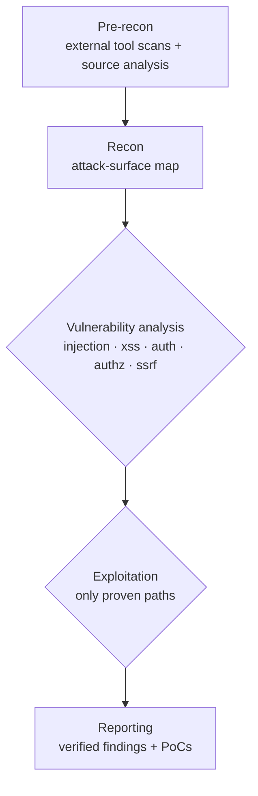

# Running a pentest
{: .no_toc }

The complete lifecycle of a single assessment — choosing a target, providing source, launching the run, and collecting results.

1. TOC
{:toc}

---

## The two inputs

Every run is built from two things:

| Input | What it is | How to provide it |
|:------|:-----------|:------------------|
| **`URL`** | The live, running target Dapper drives a browser against and sends requests to. | A reachable `http(s)://` URL. |
| **`REPO`** | The application's source code, used to pin findings to exact source lines and reason about the code paths behind each endpoint. | A folder under `./repos/`. |

Place your source under `./repos/` before launching. The folder name you create is the value you pass to `REPO`:

```bash
git clone https://github.com/your-org/your-app.git repos/your-app
```

You can also pass an absolute container path (`/repos/...` or `/benchmarks/...`) directly to `REPO` if you've mounted source elsewhere. The repo is optional in the [web console]({{ '/guides/web-console' | relative_url }}) (leave it blank for a pure black-box scan), but the CLI expects a source folder.

{: .tip }
> No source to share? You can still run a black-box assessment by pointing `REPO` at a near-empty folder — Dapper falls back to dynamic testing only. Findings simply won't be pinned to source lines.

## Choosing a target

Point Dapper at a **staging or test environment**, never production. Runs send real attack traffic and, when authenticated, perform destructive actions against the logged-in account.

```bash
# Hosted staging
./dapper start URL=https://staging.your-app.com REPO=your-app

# A local app running on your host machine
./dapper start URL=http://host.docker.internal:3000 REPO=your-app
```

{: .warning }
> **Local targets.** Dapper runs inside Docker, so a container's `localhost` is the container, not your machine. Use `http://host.docker.internal:<port>` to reach an app running on your host.

{: .danger }
> **Staging only.** Dapper executes proven exploits and, behind a login, can create, modify, or delete data. Always target a non-production environment with a disposable test account.

## The `./dapper start` command

```bash
./dapper start URL=<url> REPO=<name> [OPTIONS]
```

`URL` and `REPO` are required; everything else is optional. The command starts the Docker stack if it isn't already up (waiting for Temporal to become healthy), submits the workflow, and returns a **workflow ID** while the run continues in the background:

```text
Workflow started: staging-your-app-com_dapper-1781063631798
```

Keep that ID — it's how you monitor and query the run.

### All flags

| Flag | Effect |
|:-----|:-------|
| `URL=<url>` | **Required.** The live target. Use `host.docker.internal` for local apps. |
| `REPO=<name>` | **Required.** Source folder under `./repos/` (or an absolute `/repos/…` / `/benchmarks/…` container path). |
| `SUBDIR=<path>` | Focus source analysis on a subdirectory of the repo, e.g. `SUBDIR=services/api`. Ideal for monorepos. The path is validated to exist before launch. |
| `CONFIG=<file>` | YAML config for [authenticated testing]({{ '/guides/authenticated-testing' | relative_url }}), scope rules, and coverage settings. |
| `OUTPUT=<path>` | Custom output directory (default `./audit-logs/`). The directory is created and made writable for the container user. |
| `PIPELINE_TESTING=true` | Fast, shallow pass with minimal prompts and short retry intervals — for smoke-testing your setup, not for real findings. |
| `ROUTER=true` | Route SDK requests through an alternative LLM provider (OpenAI, OpenRouter, Ollama). See [LLM providers]({{ '/reference/llm-providers' | relative_url }}). |
| `REBUILD=true` | Force a clean `--no-cache` Docker rebuild of the worker. Use after editing Dapper's own source. |

See the full [CLI reference]({{ '/reference/cli' | relative_url }}) for `logs`, `query`, `stop`, `web`, and `deepagent`.

### Examples

```bash
# Plain run
./dapper start URL=https://staging.example.com REPO=example-app

# Focus on one service in a monorepo
./dapper start URL=https://staging.example.com REPO=example-app SUBDIR=services/api

# Authenticated run with a config
./dapper start URL=https://staging.example.com REPO=example-app \
               CONFIG=./configs/example-app.yaml

# Custom output location
./dapper start URL=https://staging.example.com REPO=example-app \
               OUTPUT=./reports/2026-q2

# Quick smoke test of the pipeline (minimal prompts, fast)
./dapper start URL=https://staging.example.com REPO=example-app PIPELINE_TESTING=true

# Route through an alternative provider
./dapper start URL=https://staging.example.com REPO=example-app ROUTER=true
```

## What happens during a run

Dapper executes a five-phase pipeline. The vulnerability and exploitation phases each run **five agents in parallel**, so their timelines overlap. Exploitation agents only run where the matching vulnerability phase found something to chase.



| Phase | What it does | Agents |
|:------|:-------------|:-------|
| **Pre-recon** | External scans (nmap, subfinder, whatweb) plus an initial pass over the source. | 1 |
| **Recon** | Synthesises the scans and source into an attack-surface map. | 1 |
| **Vulnerability analysis** | Hunts for candidate weaknesses across five classes, in parallel. | 5 |
| **Exploitation** | Attempts to actually exploit each candidate, in parallel — proof, not theory. | up to 5 |
| **Reporting** | Assembles verified findings into an executive-level report. | 1 |

Deliverables are written incrementally as findings are confirmed, so you don't have to wait for the run to finish to start reading. Follow along with [Monitoring runs]({{ '/guides/monitoring-runs' | relative_url }}).

{: .note }
> Each agent retries transient failures automatically (up to 3 attempts), and because the workflow is durable on Temporal, a crashed worker resumes from its last checkpoint instead of starting over.

## Scoping a run

Two config sections steer where Dapper spends its effort. Pass them in your `CONFIG` file.

**`rules`** keep Dapper on target — avoid shared or dangerous routes, or prioritise the surface you care about:

```yaml
rules:
  avoid:
    - description: "Skip logout so we don't kill our own session"
      type: path
      url_path: "/logout"
    - description: "No DELETE on the users API"
      type: path
      url_path: "/api/v1/users/*"
  focus:
    - description: "Prioritise the v2 API"
      type: path
      url_path: "/api/v2"
```

**`coverage`** trades breadth against precision. The default is precision (exploit-verified findings only):

```yaml
coverage:
  mode: coverage          # 'precision' (default) or 'coverage'
  include_potential: true # surface non-exploited candidates too
  max_findings: 100
```

See the [Configuration reference]({{ '/reference/configuration' | relative_url }}) for every field, including `targets`, `accounts`, `seed_data`, `exploration`, and `schemas`.

## Where output goes

Results land under `./audit-logs/<host>_<sessionId>/` (or your `OUTPUT` path):

```text
audit-logs/<host>_<sessionId>/
├── deliverables/    # the report — Markdown, HTML, PDF, JSON, CSV
├── session.json     # per-agent / per-phase cost and duration metrics
├── agents/          # turn-by-turn execution logs
├── prompts/         # exact prompts used (reproducibility)
└── workflow.log     # orchestration log
```

When the workflow completes, head to [Reading the report]({{ '/guides/reading-the-report' | relative_url }}) to interpret the findings, or [Output & deliverables]({{ '/reference/output-deliverables' | relative_url }}) for the full directory reference.

## Stop and clean up

```bash
./dapper stop                # stop containers, keep workflow data and volumes
./dapper stop CLEAN=true     # full reset including Temporal volumes
```

`./dapper stop` leaves your audit logs on disk untouched — it only stops the running containers. Use `CLEAN=true` when you want a completely fresh Temporal state.
